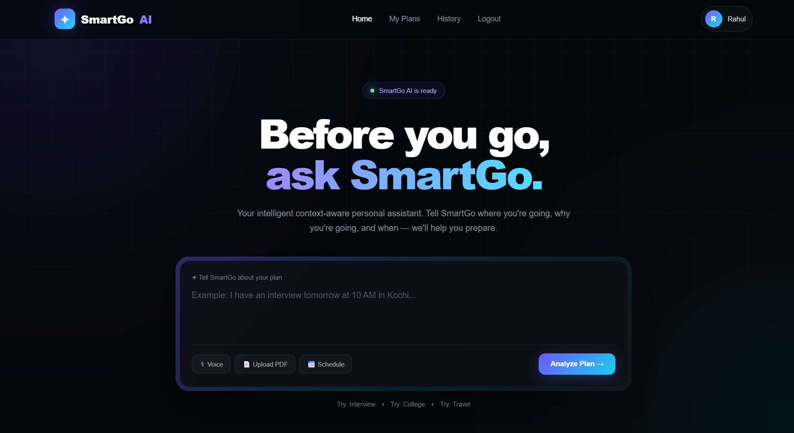
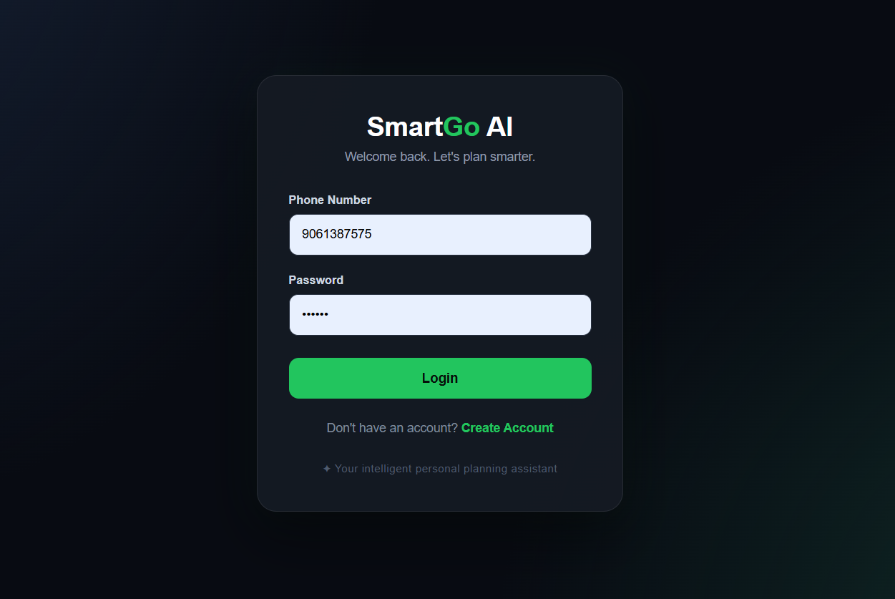
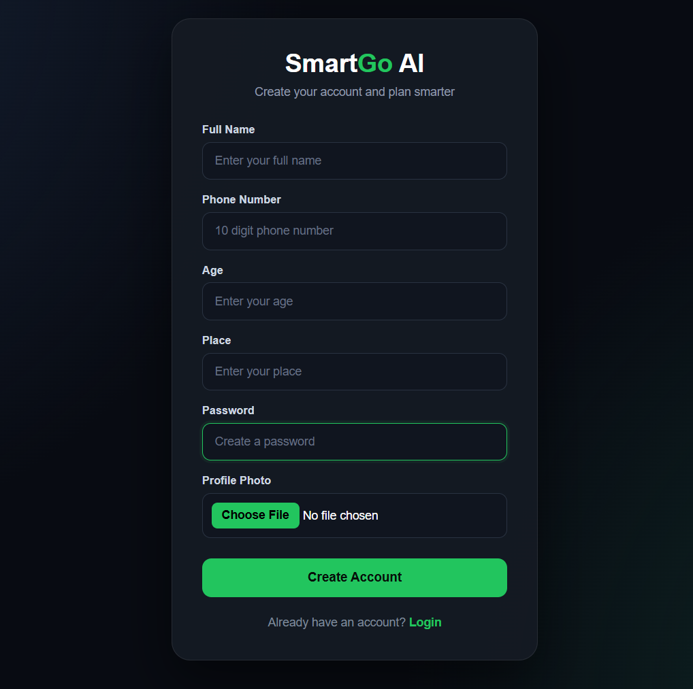
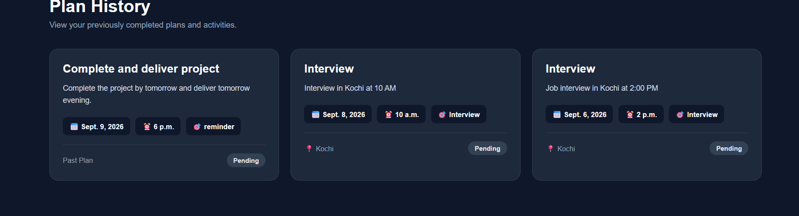

# SmartGoAI 🤖

SmartGoAI is a Django-based AI web application that integrates **Google Gemini Generative AI** to provide an interactive AI-powered experience through a web interface.

## 🚀 Features

* 🤖 AI-powered responses using Google Gemini
* 📄 Resume and file upload
* 📑 PDF resume text extraction and processing
* 🎤 Voice input using speech-to-text
* 🔐 User Signup and Login
* 👤 User Profile and Profile Photo
* 📋 Plan Management
* 🕘 Conversation/Prediction History
* 🌐 Django-based web interface
* 🔑 Secure API key management using environment variables

## 🧠 AI Features

### 📄 Resume Upload

Users can upload their resume and provide it to SmartGoAI for AI-powered analysis.

The application can process the uploaded resume and use the extracted information to provide relevant responses and suggestions.

### 🎤 Voice Input

SmartGoAI supports voice-based input, allowing users to speak their questions instead of typing them.

The voice is converted into text and then processed by the AI system.

```text
🎤 User speaks
      ↓
Speech-to-Text
      ↓
Text Input
      ↓
Gemini AI
      ↓
AI Response
```

## 🛠️ Technologies Used

* **Python**
* **Django**
* **Google Gemini Generative AI**
* **PyPDF**
* **HTML**
* **CSS**
* **JavaScript**
* **Web Speech API**
* **SQLite / Django Database**
* **python-dotenv**

## 📸 Screenshots

### Home Page



### Login Page



### Signup Page




### History



## 🎯 Project Purpose

The purpose of SmartGoAI is to build a practical AI-powered web application that combines **Django web development, Generative AI, document processing, and speech-based interaction**.

The project demonstrates experience with:

* Django backend development
* Frontend and backend integration
* User authentication
* Database management
* File uploading and handling
* PDF text extraction
* Generative AI integration
* Voice-to-text interaction
* API integration
* Environment variable management

## 🔮 Future Improvements

* Support additional document formats
* Improve resume analysis
* Add personalized career recommendations
* Add AI-generated interview questions based on uploaded resumes
* Improve voice interaction
* Add text-to-speech responses
* Improve UI/UX
